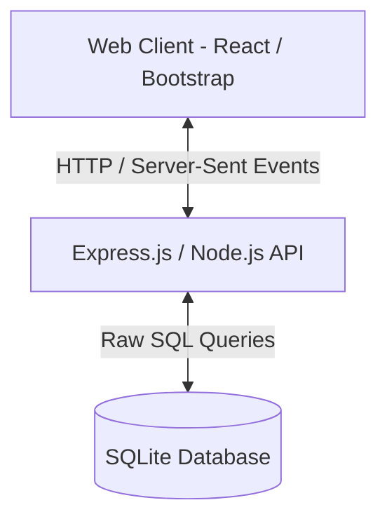

# Team Task Tracker - REST API & Bootstrap React Dashboard

A modern, multi-tenant team task tracker application built for the **SDE II Take-Home Assignment**. This application features secure JWT-based authentication with active refresh token rotation, granular middleware-enforced role-based access control (RBAC), and real-time Server-Sent Events (SSE). 

The frontend is a glassmorphic dark-mode single-page dashboard built in React (Vite + TypeScript) and styled using custom dark-theme tokens layered over Bootstrap.

---

## Technical Stack Architecture



- **Backend**: Node.js, Express, `sqlite3` (Raw SQL queries), `jsonwebtoken`, `bcryptjs`, Jest, Supertest.
- **Frontend**: React (Vite), TypeScript, Bootstrap 5, Bootstrap Icons, Lucide Icons, Chart.js, React-Chartjs-2.
- **Database**: SQLite (No local server or installation needed!).

---

## Credentials Pre-Seeded for Quick Testing

The SQLite database file (`tasktracker.db`) is automatically initialized and pre-seeded with the organization **NxtWave Corp** and four users, each representing different access levels. You can log in directly using the following credentials:

| Role | Email | Password | Allowed Permissions |
| :--- | :--- | :--- | :--- |
| **ADMIN** | `admin@nxtwave.com` | `admin123` | Full access. Manage organization users, projects, and all tasks. |
| **MANAGER** | `manager@nxtwave.com` | `manager123` | Manage organization projects and tasks. Assign tasks. Cannot manage users. |
| **MEMBER (1)** | `john@nxtwave.com` | `member123` | View and transition status *only* for tasks assigned to him. |
| **MEMBER (2)** | `sarah@nxtwave.com` | `member123` | View and transition status *only* for tasks assigned to her. |

---

## Zero-Dependency Local Setup & Run

Both the backend and frontend run directly on your own system with standard npm commands:

### 1. Start the Express API Backend
Open a terminal in the backend directory and run:
```bash
cd backend
npm run dev
```
- Starts the backend on **`http://localhost:5000`**.
- Automatically configures, loads, and initializes the local SQLite database file `tasktracker.db`.

### 2. Start the React Frontend Dashboard
Open a second terminal in the frontend directory and run:
```bash
cd frontend
npm run dev
```
- Starts the React development server.
- The web app will launch and connect immediately to the backend Express server.

---

## Core System Architecture & Design Choices

### 1. Database Schema & Design Choices

#### Raw SQL & Scoping Decisions
- We chose **Vanilla JS** and **Raw SQL queries (via node-postgres `pg` pool)** instead of an ORM. This demonstrates high proficiency in database design, transaction isolation, and writing performance-tuned analytical CTEs.
- **Scoping**: All projects and tasks are foreign-keyed to an `Organization` boundary, guaranteeing absolute logical data isolation for multi-tenant users.

#### Performance Indexing Strategy
To optimize database throughput, we created explicit single-column indexes on highly targeted fields within the `tasks` table:
```sql
CREATE INDEX IF NOT EXISTS idx_tasks_status ON tasks(status);
CREATE INDEX IF NOT EXISTS idx_tasks_assignee ON tasks(assignee_id);
CREATE INDEX IF NOT EXISTS idx_tasks_due_date ON tasks(due_date);
```
- **Rationale**: 
  - `status` and `assignee_id` are the most frequent filter conditions when populating user boards and running dashboard listings.
  - `due_date` is highly dynamic and is indexed to allow rapid sorting (placing closest deadlines first) and immediate filtering of overdue tasks inside our background analytics scheduler.
  - Indexing these foreign keys ensures our database joins operate at $O(\log N)$ logarithmic cost rather than requiring expensive full-table scans ($O(N)$).

#### Task Status History Logging
- To implement our bonus average completion time tracking, we designed a `task_status_history` audit table. Every time a task status changes, a row is recorded tracking the transition (`from_status`, `to_status`, `changed_by_id`, `changed_at`). This enables precise, granular telemetry without cluttering the primary `tasks` table.

---

### 3. Enforced Status Transition State Machine

Task status changes are guarded by a strict Express transition engine (`taskController.js`), preventing unauthorized updates:
- **Rules**:
  - `TODO` $\rightarrow$ `IN_PROGRESS` or `BLOCKED`
  - `IN_PROGRESS` $\rightarrow$ `IN_REVIEW` or `BLOCKED`
  - `IN_REVIEW` $\rightarrow$ `DONE`, `IN_PROGRESS` (if revisions requested), or `BLOCKED`
  - `BLOCKED` $\rightarrow$ `TODO`, `IN_PROGRESS`, `IN_REVIEW`, or `DONE` (when resolved)
- **Role Verification**:
  - **MEMBERs** can *only* transition tasks assigned directly to them. 
  - **ADMIN/MANAGERs** can transition any task inside the organization.
  - Reopening a `DONE` task to `TODO`/`IN_PROGRESS` is restricted strictly to ADMIN and MANAGER roles.

---

### 4. Real-time Notifications & Analytics

- **Real-Time Push (SSE)**: We built a custom **Server-Sent Events (SSE)** channel `/api/notifications/subscribe`. When a manager advances or blocks a task, a push event is dispatched to the active SSE listener of the task's assignee, sliding in a glowing notification banner.
- **Aggregation Analytics**:
  - **Overdue Count**: Compiled using a SQL aggregate joining users and task dates.
  - **Average Completion Time**: Calculated using a SQL **Common Table Expression (CTE)** that measures the duration from the task's first transition to `IN_PROGRESS` to its first transition to `DONE` based on historical logs, falling back to the creation time if started transition was skipped.

---

## Future Enhancements & Scalability

Given more time, we would build out:
1. **Refresh Token Cleanups**: Establish a cron worker in the background that periodically deletes expired or revoked refresh tokens from the database.
2. **WebSockets for Bi-directional Chat**: Evolve our SSE notifications into a full-duplex WebSocket connection, allowing team members to chat and drop comments directly inside task cards.
3. **Optimized Redis Pipelines**: Utilize Redis transaction pipelines (`multi/exec`) to combine multiple cache deletions into single-atomic updates, reducing network roundtrips during bulk task modifications.
4. **Active Directory (SSO) Support**: Integrate SAML/OIDC authentication protocols to support enterprise organizational environments.
