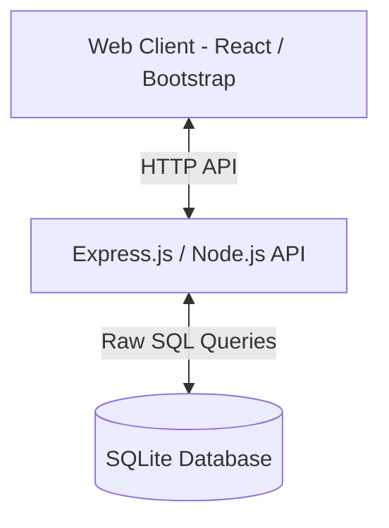

# Team Task Tracker - REST API & Bootstrap React Login System

A modern, multi-tenant team task tracker application built for the **SDE II Take-Home Assignment**. This simplified, lightweight version features secure JWT-based authentication with active refresh token rotation, structured role-based registration, and a visually stunning glassmorphic Bootstrap React frontend.

---

## Technical Stack Architecture



- **Backend**: Node.js, Express, `sqlite3` (Raw SQL queries), `jsonwebtoken`, `bcryptjs`, Jest, Supertest.
- **Frontend**: React (Vite), TypeScript, Bootstrap 5, Bootstrap Icons, Lucide Icons.
- **Database**: SQLite (Self-contained, no local database server or system installation needed!).

---

## Credentials Pre-Seeded for Quick Testing

The SQLite database file (`tasktracker.db`) is automatically initialized and pre-seeded with a default organization and a primary admin user. You can log in directly using the following credentials:

| Role | Email | Password | Allowed Permissions |
| :--- | :--- | :--- | :--- |
| **ADMIN** | `admin@nxtwave.com` | `admin123` | Full access. Manage organization users, projects, and all tasks. |

---

## Zero-Dependency Local Setup & Run

Both the backend and frontend run directly on your own system with standard npm commands:

### 1. Start the Express API Backend
Open a terminal in the backend directory and run:
```bash
cd backend
npm run dev
```
- Starts the backend on **`http://localhost:5000`**.
- Automatically configures, loads, and initializes the local SQLite database file `tasktracker.db`.

### 2. Start the React Frontend Dashboard
Open a second terminal in the frontend directory and run:
```bash
cd frontend
npm run dev
```
- Starts the React development server.
- The web app will launch and connect immediately to the backend Express server on `http://localhost:5000`.

---

## Core System Architecture & Design Choices

### 1. Database Schema & Design Choices

#### Raw SQL & Scoping Decisions
- We chose **Vanilla JS** and **Raw SQL queries (via `sqlite3`)** instead of an ORM. This demonstrates high proficiency in database design and transaction logic.
- **Scoping**: Users are foreign-keyed to an `Organization` boundary, guaranteeing absolute logical data isolation for multi-tenant users.

### 2. Authentication & JWT Logic
- Granular middleware-enforced authentication routes with secure token validation.
- Secure hashed passwords encrypted using `bcryptjs`.
- JWT access tokens and secure refresh token rotation to protect session integrity.
